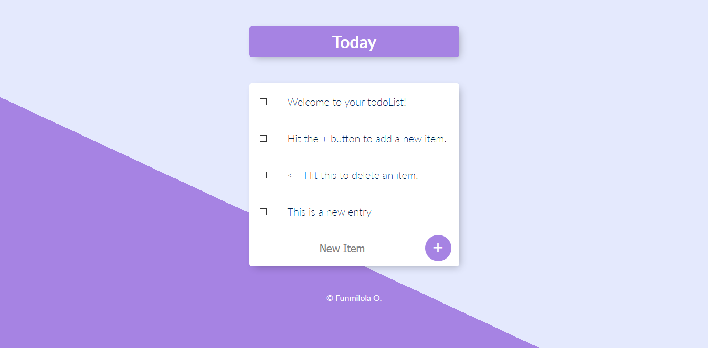

# ToDo App  

> A Todo app created using node, ejs and mongodb.

## Table of contents  

- [General info](#general-info)
- [Screenshots](#screenshots)
- [Technologies](#technologies)
- [Setup](#setup)
- [Features](#features)
- [Status](#status)
- [Inspiration](#inspiration)
- [Contact](#contact)

## General info  

A Todo app that retrieves previous data from mongodb collection and displays them on load, allows you add new items to the list, delete items from the list and also create custom lists by adding '/nameOfList' to the end of the url and clicking 'enter'.

## Screenshots  

## Technologies  

- Body Parser - 1.19.0
- EJS - 2.7.4
- Express - 4.17.1
- Lodash - 4.17.20
- MongoDB - 3.6.2
- Mongoose - 5.10.6

## Setup  

Visit [ToDo App](https://mytodoleest.herokuapp.com/) in your browser.

## Features  

- Display Items retrieved from the database on load
- Add Items to the list
- Delete Items from the list
- Create new custom lists

## Status  

Project is: _finished_

## Inspiration  

Project was inspired by a challenge from a udemy course.

## Contact  

Created by [@funmilolajire](mailto:funmilolajire@gmail.com) - feel free to contact me!  

